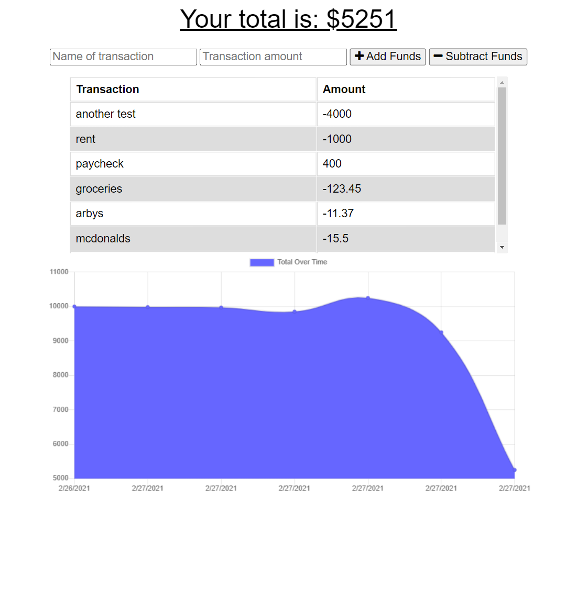

# Budget Tracker
  
## My story
* As someone that is bad with managing bills, I can utitlize this app to keep track of specifics bills I may have
* Beggining to understand how Caching and database storage is different
* This App allows a user fast and easy access to a more straight forward approach to managing bills vs an online banking app.
## Features ##
* Enables a User to keep track of type of transaction and cost\
* keeps a tally of total balance remaining
* offline and online
* Add or subtract from total balance
## Installation ##
1. Open up git bash terminal
2. Change directory to desired location (%User Profile%/SourceRepo)
3. Clone the repository (git clone git@github.com:ChristianGoldman/Budget-Tracker.git)
## Usage ##
1. Open up git bash terminal
2. Change directory to the cloned repo
3. Navigate to the Content-Management-Systems folder
4. In the command line run "npm install"
5. In the commmand line run "npm start"
6. Open default browser and enter this line into the address bar "localhost:3000/"
7. Input any desired amounts into the input fields!
8.  You should see a webpage similar to this!

## Credits ##
* Cwerness gitlab
* https://umn.bootcampcontent.com/University-of-Minnesota-Boot-Camp/uofm-stp-fsf-pt-09-2020-u-c/blob/master/01-Class-Content/13-MVC/04-Important/MySQLHerokuDeploymentProcess.pdf
* https://expressjs.com/en/guide/routing.html
* BCS learning assistants
* TA's Paul Hendrickson, Tommy Boone, Jake O'Thoole, Daniel Thao
## Link to GitHub
[GitHub](https://github.com/ChristianGoldman/Budget-Tracker)
## Link to Heroku App
[Budget Tracker](https://git.heroku.com/damp-inlet-30258.git
)
## License ##
    MIT License

    Copyright (c) [2020] [Christian Goldman]

    Permission is hereby granted, free of charge, to any person obtaining a copy
    of this software and associated documentation files (the "Software"), to deal
    in the Software without restriction, including without limitation the rights
    to use, copy, modify, merge, publish, distribute, sublicense, and/or sell
    copies of the Software, and to permit persons to whom the Software is
    furnished to do so, subject to the following conditions:

    The above copyright notice and this permission notice shall be included in all
    copies or substantial portions of the Software.

    THE SOFTWARE IS PROVIDED "AS IS", WITHOUT WARRANTY OF ANY KIND, EXPRESS OR
    IMPLIED, INCLUDING BUT NOT LIMITED TO THE WARRANTIES OF MERCHANTABILITY,
    FITNESS FOR A PARTICULAR PURPOSE AND NONINFRINGEMENT. IN NO EVENT SHALL THE
    AUTHORS OR COPYRIGHT HOLDERS BE LIABLE FOR ANY CLAIM, DAMAGES OR OTHER
    LIABILITY, WHETHER IN AN ACTION OF CONTRACT, TORT OR OTHERWISE, ARISING FROM,
    OUT OF OR IN CONNECTION WITH THE SOFTWARE OR THE USE OR OTHER DEALINGS IN THE
    SOFTWARE.